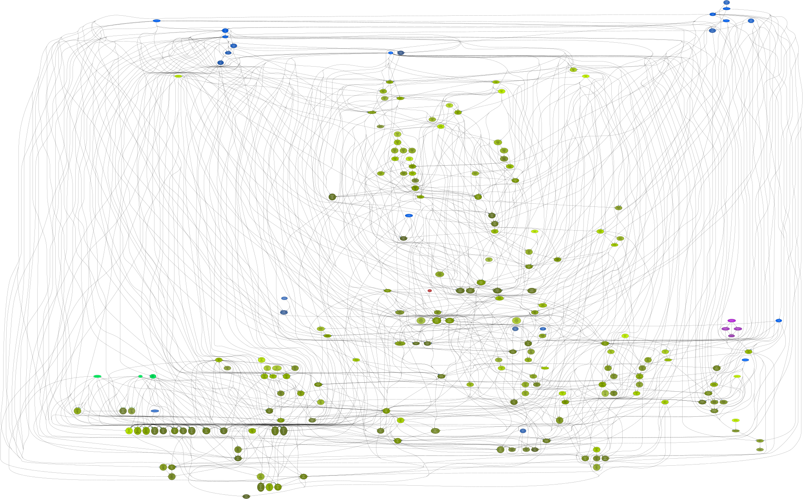

<!--
    =====================================
    generator=datazen
    version=3.1.4
    hash=4f8a71a6066638ed1a90f375188f0578
    =====================================
-->

# runtimepy ([5.4.2](https://pypi.org/project/runtimepy/))

[](https://pypi.org/project/runtimepy/)

[](https://codecov.io/github/vkottler/runtimepy)


*A framework for implementing Python services.*

## Documentation

### Generated

* By [sphinx-apidoc](https://vkottler.github.io/python/sphinx/runtimepy)
(What's [`sphinx-apidoc`](https://www.sphinx-doc.org/en/master/man/sphinx-apidoc.html)?)
* By [pydoc](https://vkottler.github.io/python/pydoc/runtimepy.html)
(What's [`pydoc`](https://docs.python.org/3/library/pydoc.html)?)

## Python Version Support

This package is tested with the following Python minor versions:

* [`python3.11`](https://docs.python.org/3.11/)
* [`python3.12`](https://docs.python.org/3.12/)

## Platform Support

This package is tested on the following platforms:

* `ubuntu-latest`
* `macos-latest`
* `windows-latest`

# Introduction

# Command-line Options

```
$ ./venv3.12/bin/runtimepy -h

usage: runtimepy [-h] [--version] [-v] [-q] [--curses] [--no-uvloop] [-C DIR]
                 {arbiter,server,task,tftp,tui,noop} ...

A framework for implementing Python services.

options:
  -h, --help            show this help message and exit
  --version             show program's version number and exit
  -v, --verbose         set to increase logging verbosity
  -q, --quiet           set to reduce output
  --curses              whether or not to use curses.wrapper when starting
  --no-uvloop           whether or not to disable uvloop as event loop driver
  -C DIR, --dir DIR     execute from a specific directory

commands:
  {arbiter,server,task,tftp,tui,noop}
                        set of available commands
    arbiter             run a connection-arbiter application from a config
    server              run a server for a specific connection factory
    task                run a task from a specific task factory
    tftp                perform a tftp interaction
    tui                 run a terminal interface for the channel environment
    noop                command stub (does nothing)

```

## Sub-command Options

### `arbiter`

```
$ ./venv3.12/bin/runtimepy arbiter -h

usage: runtimepy arbiter [-h] [-i] [-w] [--no-poller] configs [configs ...]

positional arguments:
  configs               the configuration to load

options:
  -h, --help            show this help message and exit
  -i, --init_only, --init-only
                        exit after completing initialization
  -w, --wait-for-stop, --wait_for_stop
                        ensure that a 'wait_for_stop' application method is
                        run last
  --no-poller           don't run a connection-metrics poller task

```

### `server`

```
$ ./venv3.12/bin/runtimepy server -h

usage: runtimepy server [-h] [-i] [-w] [--no-poller] [--host HOST] [-p PORT]
                        [-u] [-l]
                        factory [configs ...]

positional arguments:
  factory               name of connection factory to create server for
  configs               the configuration to load

options:
  -h, --help            show this help message and exit
  -i, --init_only, --init-only
                        exit after completing initialization
  -w, --wait-for-stop, --wait_for_stop
                        ensure that a 'wait_for_stop' application method is
                        run last
  --no-poller           don't run a connection-metrics poller task
  --host HOST           host address to listen on (default: '0.0.0.0')
  -p PORT, --port PORT  port to listen on (default: 0)
  -u, --udp             whether or not this is a UDP-based server (otherwise
                        it must be a TCP-based server)
  -l, --loopback        if true a client of the same connection type is added

```

### `task`

```
$ ./venv3.12/bin/runtimepy task -h

usage: runtimepy task [-h] [-i] [-w] [--no-poller] [-r RATE]
                      factory [configs ...]

positional arguments:
  factory               name of task factory to create task with
  configs               the configuration to load

options:
  -h, --help            show this help message and exit
  -i, --init_only, --init-only
                        exit after completing initialization
  -w, --wait-for-stop, --wait_for_stop
                        ensure that a 'wait_for_stop' application method is
                        run last
  --no-poller           don't run a connection-metrics poller task
  -r RATE, --rate RATE  rate (in Hz) that the task should run (default: 10)

```

### `tftp`

```
$ ./venv3.12/bin/runtimepy tftp -h

usage: runtimepy tftp [-h] [-p PORT] [-m MODE] [-t TIMEOUT] [-r REEMIT]
                      {read,write} host our_file [their_file]

positional arguments:
  {read,write}          action to perform
  host                  host to message
  our_file              path to our file
  their_file            path to their file

options:
  -h, --help            show this help message and exit
  -p PORT, --port PORT  port to message (default: 69)
  -m MODE, --mode MODE  tftp mode to use (default: octet)
  -t TIMEOUT, --timeout TIMEOUT
                        timeout for each step
  -r REEMIT, --reemit REEMIT
                        transmit period for each step

```

### `tui`

```
$ ./venv3.12/bin/runtimepy tui -h

usage: runtimepy tui [-h] [-i ITERATIONS] [-r RATE]

options:
  -h, --help            show this help message and exit
  -i ITERATIONS, --iterations ITERATIONS
                        maximum number of program iterations (if greater than
                        zero, default: 0)
  -r RATE, --rate RATE  frequency (in Hz) to run the interface (default: 60.0
                        Hz)

```

# Internal Dependency Graph

A coarse view of the internal structure and scale of
`runtimepy`'s source.
Generated using [pydeps](https://github.com/thebjorn/pydeps) (via
`mk python-deps`).


